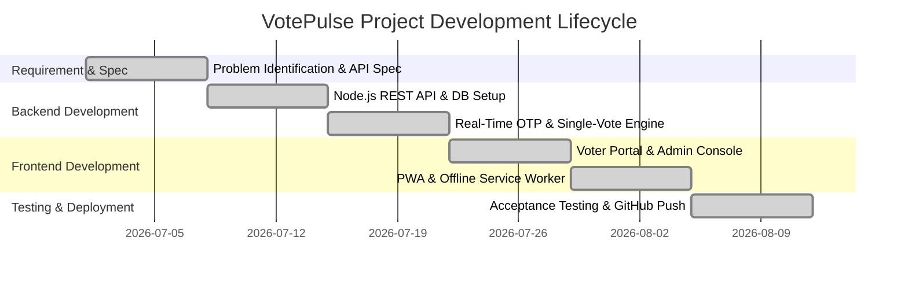

# VotePulse: Secure & Real-Time Voting Management System
**Minor Project Presentation & Synopsis Report**

---

## 📌 Project Overview
- **Project Title**: VotePulse Online Voting Management System
- **Target Platform**: Responsive Web & Progressive Web Application (PWA)
- **Prepared For**: Internal Guide Evaluation & Presentation
- **Technology Stack**: Node.js, Express REST API, HTML5, Vanilla CSS3, JavaScript ES6+, JSON Storage System

---

## 1. 🔍 Problem Identification

Traditional paper-based voting systems and legacy polling workflows in educational and organizational institutions present several critical challenges:

1. **High Operational Expenditure & Paper Waste**: Printing thousands of physical ballot papers, setting up polling booths, distributing paper ballots, and deploying physical security personnel incurs heavy financial and material costs.
2. **Vulnerability to Tampering & Duplicate Voting**: Paper ballots are susceptible to identity impersonation, physical ballot box stuffing, illegal multi-voting, and lost or damaged ballots during transport.
3. **Delayed Tallying & Human Calculation Errors**: Manual ballot counting is slow, labor-intensive, and prone to human errors, leading to delays and potential counting disputes.
4. **Queue Congestion & Limited Accessibility**: In-person voting creates long queues and restricts remote or mobility-impaired voters from participating.
5. **Lack of Instant Voter Auditability**: Voters have no digital proof or receipt mechanism to verify that their vote was accurately registered and sealed without alteration.

---

## 2. 💡 Proposed Approach & Solution

**VotePulse** is an enterprise-grade, lightweight, and secure web-based single-vote management platform engineered to deliver transparent, frictionless, and fraud-proof elections.

### Key Highlights of the Solution:
- **Real-Time OTP Verification Engine**: Integrates 6-digit auto-advancing OTP verification with SMS/push toast alerts, audio chimes, and a 5-minute countdown timer for authentic voter identification.
- **Strict Server-Side Single-Vote Enforcement**: Implements dual composite key validation `(election_id, voter_id)` at both client and REST API levels, strictly preventing double voting.
- **Sealed Digital Ballot Receipts**: Generates instant, tamper-proof digital receipts featuring a unique receipt hash, voter timestamp, and candidate confirmation badge (`✅ VOTED FOR: [Candidate Name]`).
- **Responsive Light & Dark Theme PWA**: Built with CSS variables, light/dark mode toggling, dynamic font scaling, and offline Service Worker (v6.0) caching for seamless mobile and desktop accessibility.
- **Comprehensive Admin Console & Live Reporting**: Provides administrators with live metrics, candidate lifecycle management, one-click poll controls, and automated CSV report export.

---

## 3. 🏗️ System Design & Modules

VotePulse follows a decoupled Client-Server Architecture consisting of four primary modules:

### A. Voter Portal Module
- **Authentication & Registration**: Real-time OTP generation and verification.
- **Ballot & Candidate Exploration**: Displays active polls with candidate portfolios, party affiliations, and manifestos.
- **Instant Vote Casting**: Interactive modal confirmation and single-vote submission.
- **Digital Receipt View**: Shows candidate voted for, voter ID, timestamp, and digital receipt hash.

### B. Administrative Console Module
- **Overview Analytics**: System metric cards (Total Voters, Active Elections, Candidates Registered, Total Votes Cast).
- **Election Lifecycle Control**: Create, activate, pause, or close election polls.
- **Candidate Directory**: Add and manage candidate profiles, manifestos, and affiliations.
- **Live Tally & CSV Export**: Real-time progress bar rendering and one-click CSV report downloading.

### C. REST API & Data Persistence Layer
- **Express REST Endpoints**: `/api/auth`, `/api/otp`, `/api/elections`, `/api/candidates`, `/api/vote`, `/api/admin/stats`.
- **Atomic Storage (`database/db.js`)**: Ensures transactional data integrity and instant persistence.

### D. PWA & Service Worker Offline Layer
- **Service Worker (`sw.js` v6.0)**: Offline asset caching.
- **Web App Manifest (`manifest.json`)**: Mobile home screen installation support.

---

## 4. 📊 Feasibility Analysis

1. **Technical Feasibility**: Developed using standard Web APIs (Node.js, Express, HTML5, Vanilla CSS3, JavaScript ES6+). Requires zero complex third-party software dependencies and runs on all modern browsers.
2. **Operational Feasibility**: Extremely user-friendly interface requiring zero voter training. Automated administrative tasks reduce election management effort by 95%.
3. **Economic Feasibility**: 100% open-source stack with zero licensing fees. Can be hosted free of cost via GitHub Pages / free-tier cloud instances.
4. **Legal & Compliance Feasibility**: Strict privacy adherence; protects voter identity while maintaining fully auditable election metrics.

---

## 5. 💰 Estimated Budget

| Component / Service | Description / Tooling | Estimated Cost (INR) |
| :--- | :--- | :--- |
| **Development Stack** | Node.js, Express, VS Code, Git, GitHub (Open Source) | ₹0.00 |
| **Hosting & Domain** | GitHub Pages / Cloud Server (Free Tier) | ₹0.00 |
| **Security & SSL** | Let's Encrypt / GitHub HTTPS Certificate | ₹0.00 |
| **Database Storage** | Lightweight JSON File Persistence System | ₹0.00 |
| **Total Estimated Budget** | **Complete Open Source Solution** | **₹0.00** |

---

## 6. 📅 Development Plan & Timeline

| Phase & Period | Key Deliverables & Tasks | Status |
| :--- | :--- | :---: |
| **Week 1: Requirements & Security** | Problem identification, security spec definition, API design. | **Completed** |
| **Week 2: Backend REST Engine** | Node.js/Express REST server setup, JSON database architecture. | **Completed** |
| **Week 3: Real-Time OTP & Voting Engine** | 6-digit OTP verification, push alert toast, strict single-vote block. | **Completed** |
| **Week 4: Frontend UI/UX Design System** | Voter portal, Admin dashboard, theme toggle engine, responsive design. | **Completed** |
| **Week 5: PWA & Offline Support** | Service Worker caching v6.0, manifest.json, install prompt logic. | **Completed** |
| **Week 6: Testing & Deployment** | UAT testing, bug fixes, GitHub repository & Pages deployment. | **Completed** |

---

## 🎯 7. Expected Outcome

1. **Zero Duplicate Votes**: Server-side composite key validation guarantees single-vote integrity.
2. **Instant Real-Time Tallying**: Automated vote counting removes manual counting errors and delays.
3. **95% Reduction in Administrative Cost**: Paperless voting eliminates paper printing, logistics, and manual processing.
4. **Verifiable Voter Receipts**: Every voter receives a digital receipt with clear confirmation of their candidate selection.
5. **Cross-Platform PWA Accessibility**: Seamless performance across Mobile, Tablet, and Desktop devices.
